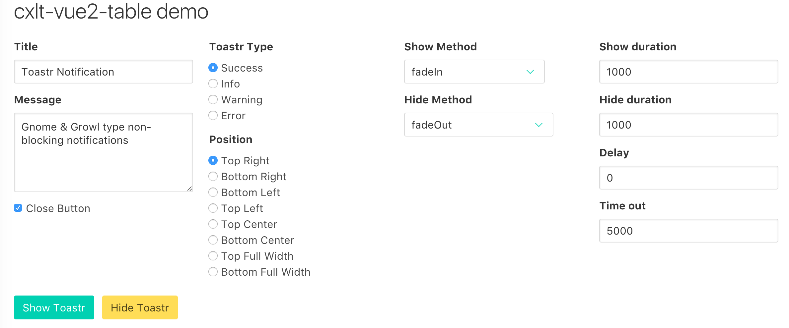

# cxlt-vue2-toastr
**cxlt-vue2-toastr**是弹出提示的Vue2组件，基于[toastr](https://github.com/CodeSeven/toastr)的样式和[animate.css](https://github.com/daneden/animate.css)的动画效果。

**Demo:** [https://chengxulvtu.github.io/toastr/index.html](https://chengxulvtu.github.io/toastr/index.html)

## 安装

使用npm
```bash
npm install cxlt-vue2-toastr --save
```
或者yarn
```bash
yarn add cxlt-vue2-toastr
```

## 用法
### 注册组件
```javascript
import CxltToastr from 'cxlt-vue2-toastr'

Vue.use(CxltToastr)
```
还可以传入一个全局配置对象
```javascript
var toastrConfigs = {
    position: 'top right',
    showDuration: 2000
}
Vue.use(CxltToastr, toastrConfigs)
```
### 引入样式
```javascript
import 'cxlt-vue2-toastr/dist/css/cxlt-vue2-toastr.css'
```
或在.vue文件中使用style
```javascript
<style src="cxlt-vue2-toastr/dist/css/cxlt-vue2-toastr.css"></style>
```
### 使用组件
```javascript
<cxlt-toastr :show="show" :toastr="toastr" @show-change="showChange"></cxlt-toastr>
```
show控制toastr的显示/隐藏，默认false

toastr是一个对象，用于控制toastr显示的标题、内容、位置等，下面的表格列举了toastr的属性

| 属性           | 类型            | 描述                        |
| ------------- |:--------------: | --------------------------:|
| title         | String          | 通知的标题                   |
| message       | String          | 通知的内容                   |
| closeButton   | Boolean         | 是否显示关闭按钮，默认false    |
| type          | String          | 通知的类型，默认success       |
| position      | String          | 通知显示的位置，默认top right  |
| showMethod    | String          | 显示动画的名称，默认fadeIn     |
| hideMethod    | String          | 隐藏动画的名称，默认fadeOut    |
| showDuration  | Number          | 显示动画持续的时间，单位ms      |
| hideDuration  | Number          | 隐藏动画持续的时间，单位ms      |
| delay         | Number          | 显示动画开始之前的延迟，单位ms，默认0，没有延迟 |
| timeOut       | Number          | toastr显示的时间，单位ms，默认5000 |

### type

* `success`
* `info`
* `warning`
* `error`

### position

* `top right`
* `bottom right`
* `bottom left`
* `top left`
* `top center`
* `bottom center`
* `top full width`
* `bottom full width`

### showMethod
  * `bounce`
  * `flash`
  * `pulse`
  * `rubberBand`
  * `shake`
  * `headShake`
  * `swing`
  * `tada`
  * `wobble`
  * `jello`
  * `bounceIn`
  * `bounceInDown`
  * `bounceInLeft`
  * `bounceInRight`
  * `bounceInUp`
  * `fadeIn`
  * `fadeInDown`
  * `fadeInDownBig`
  * `fadeInLeft`
  * `fadeInLeftBig`
  * `fadeInRight`
  * `fadeInRightBig`
  * `fadeInUp`
  * `fadeInUpBig`
  * `flipInX`
  * `flipInY`
  * `lightSpeedIn`
  * `lightSpeedOut`
  * `rotateIn`
  * `rotateInDownLeft`
  * `rotateInDownRight`
  * `rotateInUpLeft`
  * `rotateInUpRight`
  * `hinge`
  * `rollIn`
  * `zoomIn`
  * `zoomInDown`
  * `zoomInLeft`
  * `zoomInRight`
  * `zoomInUp`
  * `slideInDown`
  * `slideInLeft`
  * `slideInRight`
  * `slideInUp`

### hideMethod

  * `bounce`
  * `flash`
  * `pulse`
  * `rubberBand`
  * `shake`
  * `headShake`
  * `swing`
  * `tada`
  * `wobble`
  * `jello`
  * `bounceOut`
  * `bounceOutDown`
  * `bounceOutLeft`
  * `bounceOutRight`
  * `bounceOutUp`
  * `fadeOut`
  * `fadeOutDown`
  * `fadeOutDownBig`
  * `fadeOutLeft`
  * `fadeOutLeftBig`
  * `fadeOutRight`
  * `fadeOutRightBig`
  * `fadeOutUp`
  * `fadeOutUpBig`
  * `flipOutX`
  * `flipOutY`
  * `rotateOut`
  * `rotateOutDownLeft`
  * `rotateOutDownRight`
  * `rotateOutUpLeft`
  * `rotateOutUpRight`
  * `rollOut`
  * `zoomOut`
  * `zoomOutDown`
  * `zoomOutLeft`
  * `zoomOutRight`
  * `zoomOutUp`
  * `slideOutDown`
  * `slideOutLeft`
  * `slideOutRight`
  * `slideOutUp`

## Demo
[https://chengxulvtu.github.io/toastr/index.html](https://chengxulvtu.github.io/toastr/index.html)



## 运行程序
先fork项目，然后执行下面的命令
```bash
git clone xxx
cd cxlt-vue2-toastr
yarn
npm run dev
```

## 运行Demo

```bash
cd example
yarn
npm run dev
```
## 有问题找我
可以直接issue给我，也可以关注我的个人公众号


